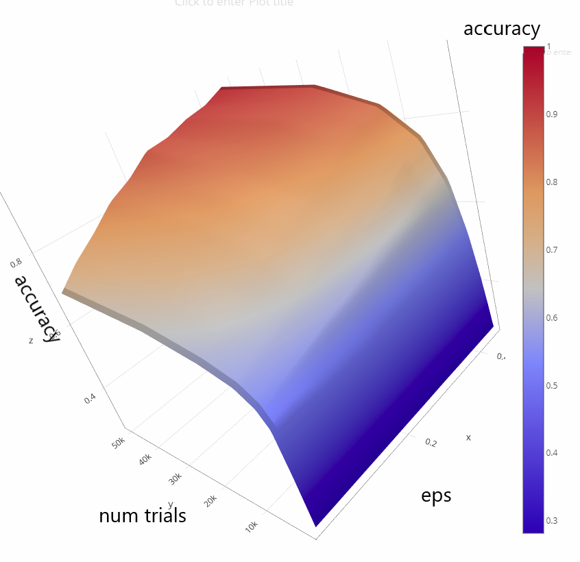

# Q-learning

[Q-Learning](https://medium.com/emergent-future/simple-reinforcement-learning-with-tensorflow-part-0-q-learning-with-tables-and-neural-networks-d195264329d0) is a strategy for reinforcement learning.
This project is a generic Q-learning library that can be applied to a variety of domains.
 
Example implementations are provided for Tic-Tac-Toe, Frozen Lake, and Finger Chopsticks. 
Each demonstrates how Q-learning can be used to find an optimal strategy to maximize result when the state space is relatively small.
Tic-Tac-Toe, for example, is a simple game with only a few thousand possible states (fewer if you account for symmetry). 
For domains where the domains are much greater, some sort of approximation to the actual set of states can be used - 
like a neural net for example.

## How to Run

From git-bash, cygwin, cmd, or online IDE shell (such as [codenvy](https://codenvy.io)), do
```$xslt
git clone https://github.com/bb4/bb4-Q-learning.git    (to clone the project repository locally)
```
then, in the newly created project directory, do one of
```
./gradlew runTTT                                       (to play Tic-Tac-Toe)
./gradlew runFrozenLake                                (to run the Frozen Lake demo)
./gradlew runChopsticks                                (to play finger chopsticks)
```

## Learn More

See [my presentation](https://docs.google.com/presentation/d/15X9KhhHxtXNZtxt-GB17prfmXOKu7EvklmZL-nz5yjQ/edit?usp=sharing) to JLHS students

## Results

Below are some surface plots, created with [Plotly](https://plot.ly/create/?fid=plotly2_demo:140), that show how well the Q-learning models learns in different domains. 
The axes on the base are for epsilon and the number of learning trials (or episodes). It's clear that more learning trials will yield more accuracy.
The epsilon parameter determines the amount of random exploration versus exploitation of knowledge learned so far.
When epsilon is larger, it meas that each transition is more likely to be selected at random - leading to more exploration of the space.


<br>Tic Tac Toe learning Accuracy for different values of epsilon and number of trial runs.


<br>Frozen Lake learning Accuracy for different values of epsilon and number of trial runs.


<br>Finger chopsticks learning Accuracy for different values of epsilon and number of trial runs.