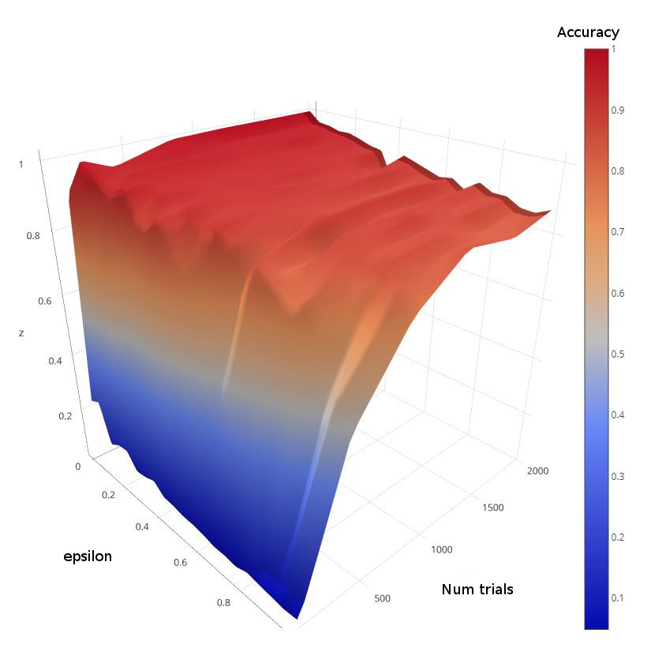

# Q-learning

[Q-Learning](https://medium.com/emergent-future/simple-reinforcement-learning-with-tensorflow-part-0-q-learning-with-tables-and-neural-networks-d195264329d0) is a strategy for reinforcement learning.
This project is a generic Q-learning library that can be applied to a variety of domains.
 
An example implementation of Tic-Tac-Toe is provided that shows how Q-learning can be used to let the computer learn to play optimally against a human.
Tic-Tac-Toe is a simple game with only a few thousand possible states (fewer if you account for symmetry). 
For domains where the domains are much greater, some sort of approximation to the actual set of states can be used - 
like a neural net for example.

Below are some surface plots, created with [Plotly](https://plot.ly/create/?fid=plotly2_demo:140), that show how well the Q-learning models learns in different domains. 
The axes on the base are for epsilon and the number of learning trials (or episodes). It's clear that more learning trials will yield more accuracy.
The epsilon parameter determines the amount of random exploration versys exploitation of knowledge learned so far.
When epsilon is larger it meas that each transition is more likely to be selected at random - leading to more exploration of the space.

 Tic Tac Toe learning Accuracy for different values of epsilon and number of trial runs

 Frozen Lake learning Accuracy for different values of epsilon and number of trial runs